# 架构可视化

## 整体架构

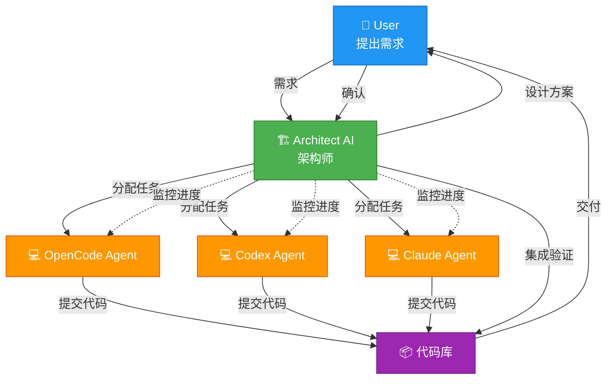

## 工作流程

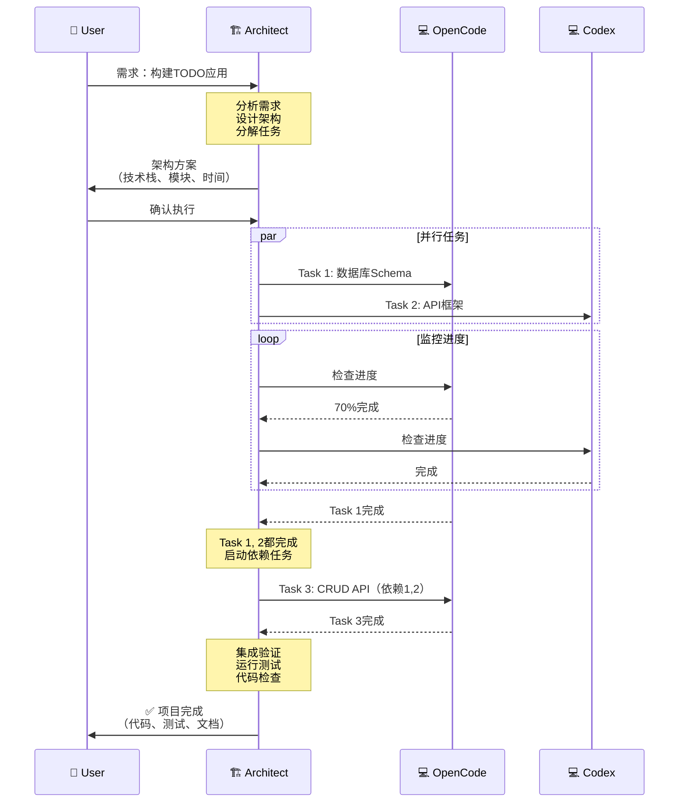

## 任务依赖关系

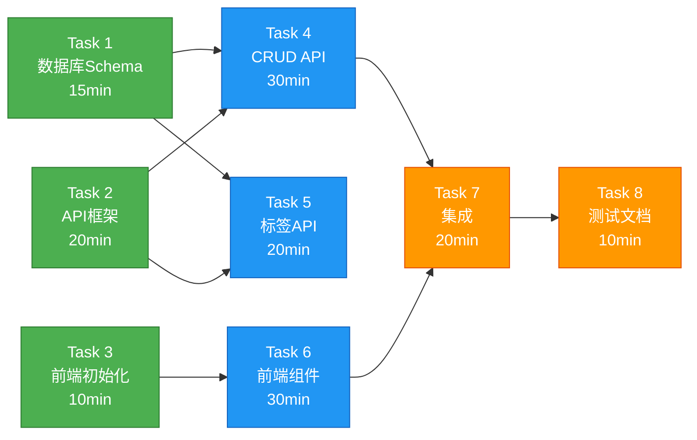

**图例：**
- 🟢 绿色：阶段1（并行，无依赖）
- 🔵 蓝色：阶段2（并行，依赖阶段1）
- 🟠 橙色：阶段3（串行，依赖阶段2）

## 并行执行时间线

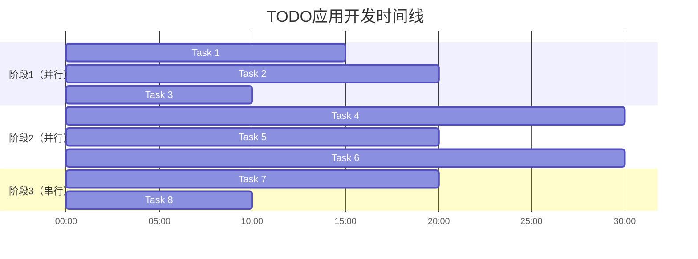

**总时间：** 
- 串行执行：15+20+10+30+20+30+20+10 = 155分钟
- 并行执行：20+30+20+10 = 80分钟
- **节省时间：75分钟（48%）**

## 监控机制

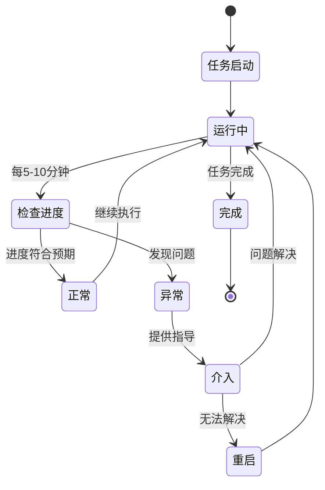

## 技术栈选择决策树

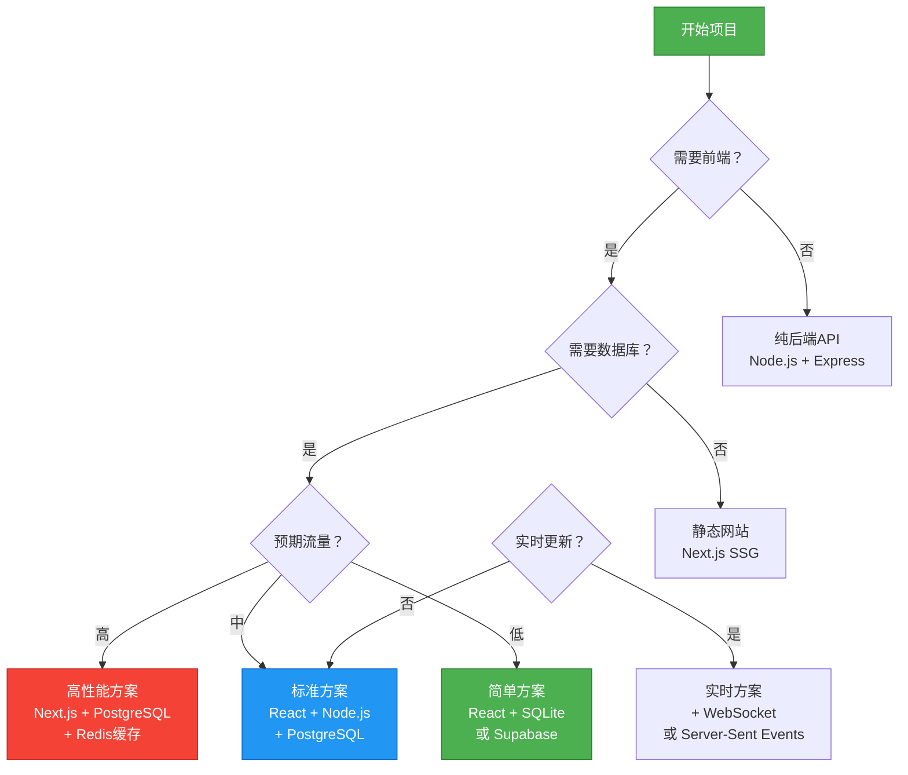

## 质量保证流程

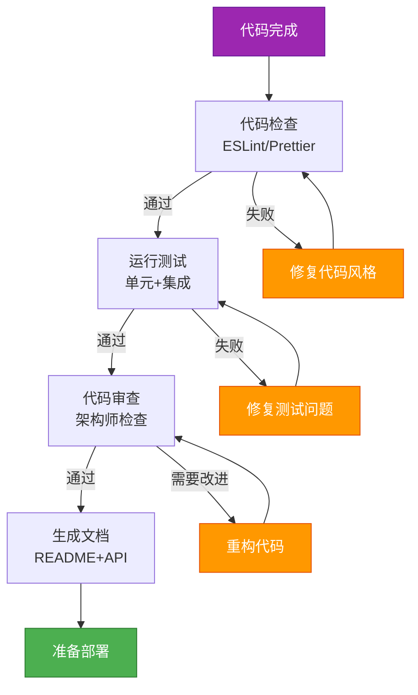

## 风险管理矩阵

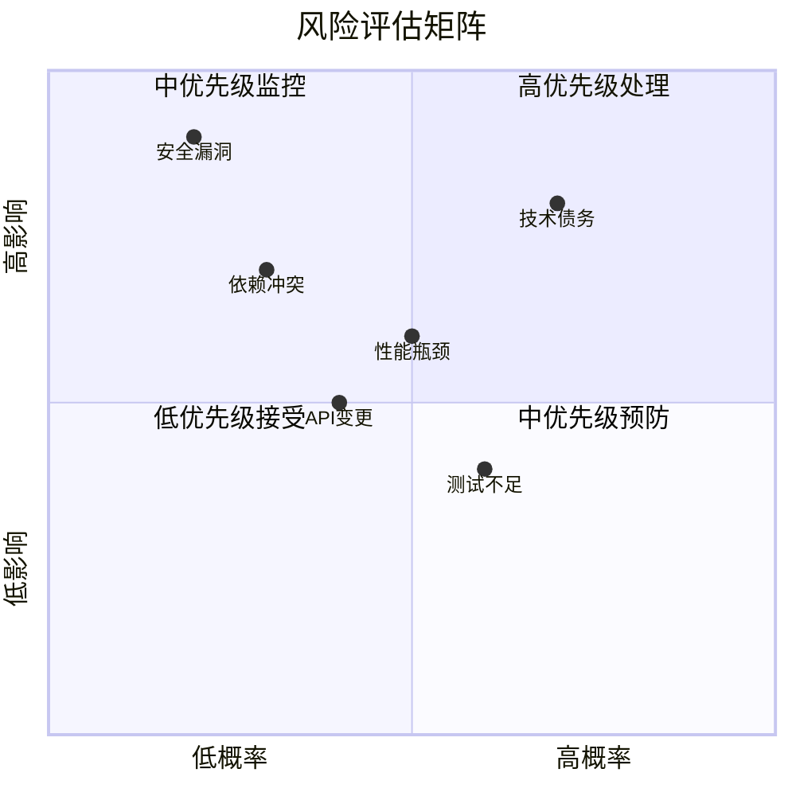

## 角色职责矩阵（RACI）

| 活动 | User | Architect | OpenCode | Codex | Claude |
|------|------|-----------|----------|-------|--------|
| 提出需求 | **R** | C | I | I | I |
| 架构设计 | C | **R/A** | I | I | I |
| 任务分解 | I | **R/A** | C | C | C |
| 编写代码 | I | C | **R** | **R** | **R** |
| 代码审查 | I | **R/A** | I | I | I |
| 集成测试 | I | **R/A** | C | C | C |
| 部署上线 | **A** | R | I | I | I |

**图例：**
- **R** (Responsible): 负责执行
- **A** (Accountable): 最终负责
- **C** (Consulted): 需要咨询
- **I** (Informed): 需要知情

## 知识流转

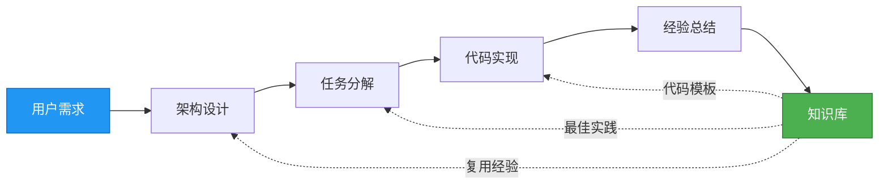

## 性能优化策略

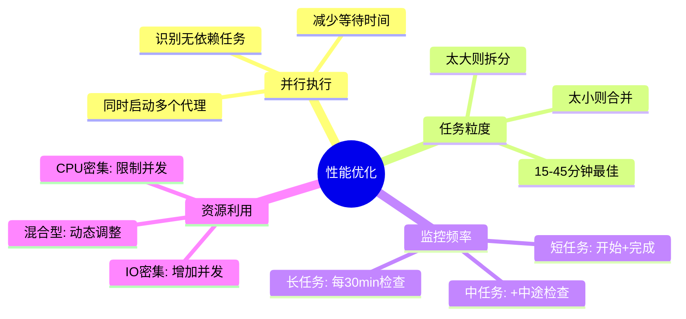

## 错误恢复流程

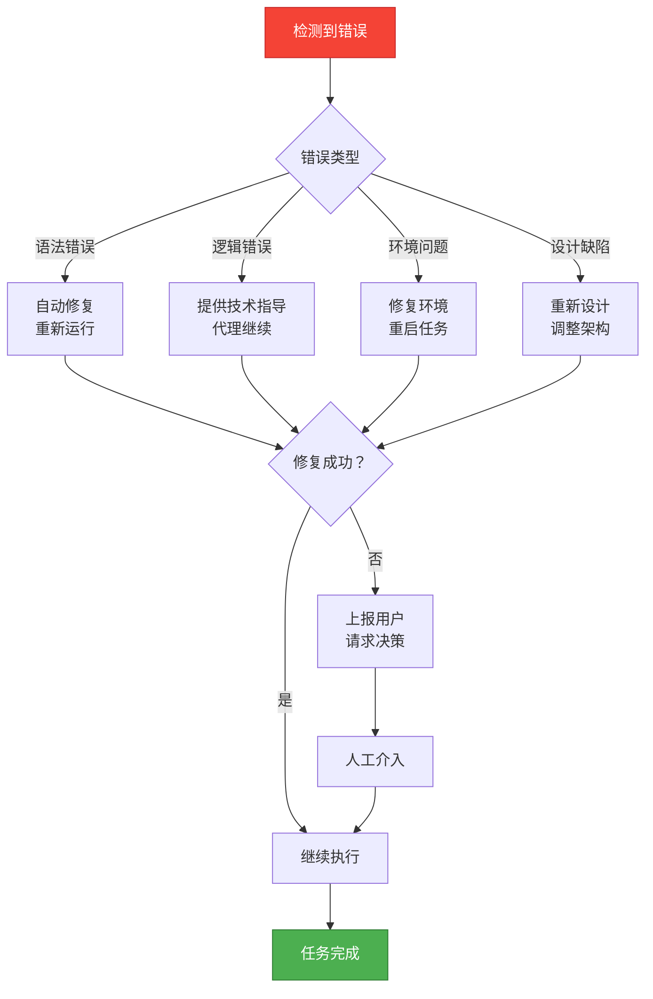

## 总结

这些图表展示了：

1. **整体架构**：角色分工和协作关系
2. **工作流程**：从需求到交付的完整过程
3. **任务依赖**：并行和串行任务的组织
4. **时间优化**：并行执行带来的效率提升
5. **监控机制**：状态转换和异常处理
6. **决策树**：技术选型的系统化方法
7. **质量保证**：代码到部署的检查流程
8. **风险管理**：优先级评估和应对策略
9. **职责矩阵**：明确各角色的责任
10. **知识流转**：经验积累和复用
11. **性能优化**：提升效率的策略
12. **错误恢复**：问题处理和升级机制

这些可视化帮助理解整个系统的运作方式。🏗️
